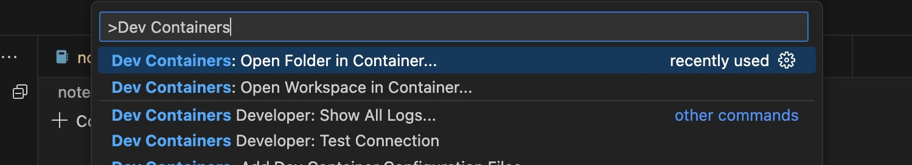
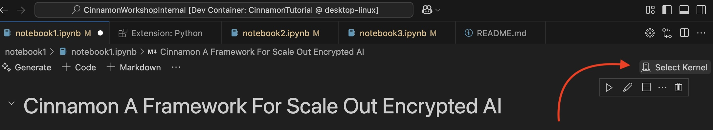
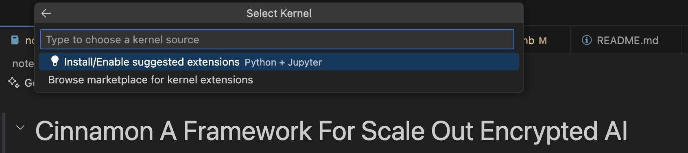
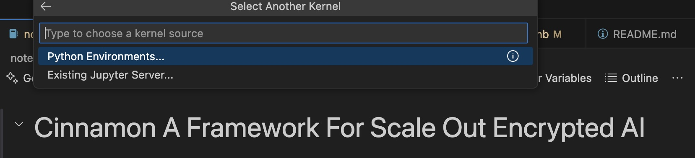
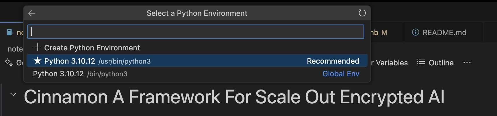

# Cinnamon: A Framework for Scale Out Encrypted AI
## Tutorial
Welcome to the tutorial on the Cinnamon Framework for scale out encrypted AI. 

### [Notebook 1:](notebook1/notebook1.ipynb)
This notebook covers the basiscs of writing and running two simple encryted programs in the Cinnamon framework.

### [Notebook 2:](notebook2/notebook2.ipynb)
Notebook2: This notebook covers implementing an encrypted logistic regression inference. in the Cinnamon framework.

### [Notebook 3:](notebook3/notebook3.ipynb)
Notebook3: This notebook covers implementing an encrypted MNIST inference in the Cinnamon framework. It covers the novel parallelization features of the Cinnamon compiler and using the Cinnamon accelerator simulator to test programs.

## Setup Instructions
### System Requirements
- **OS**: Linux, MacOS or WSL on Windows
- **Software Requirements**: [Docker](https://docs.docker.com/desktop/), [git](https://git-scm.com/downloads)
- **Recommended**: [Visual Studio Code](https://code.visualstudio.com/download). [DevContainersExtension](https://marketplace.visualstudio.com/items?itemName=ms-vscode-remote.remote-containers)

### Step1: Pull the docker container containing the runtime environment
```
docker pull sidjay10/cinnamon_tutorial:latest
```
### Step2: Running with VSCode.
Open the repository in a VSCode workspace and load the devcontainer environment. 
```
git clone https://github.com/CMU-CAOS/CinnamonTutorial
cd CinnamonTutorial
```
- Open VSCode 
- Hit F1 
- Search for Dev Containers: Open Folder in Container

- Select the folder CinnamonTutorial
- Open [notebook1](notebook1/notebook1.ipynb)
- Click on select kernel

- Install the jupyter and python extensions when prompted

- Select Python Environments

- Select the Python3.10.12 kernel when prompted


### Step2 (Alternative): Running on the browser
Run the tutorial on your browser.
```
git clone https://github.com/CMU-CAOS/CinnamonTutorial
cd CinnamonTutorial
docker run --rm --name "cinnamon_tutorial_container" -v $(pwd):/CinnamonTutorial sidjay10/cinnamon_tutorial:latest jupyter notebook /CinnamonTutorial --allow-root --no-browser --ip=0.0.0.0
```
- Look for the jupyter url of the form : `http://127.0.0.1:8888/tree?token=<token>` in the server log.
- Copy and paste your url, along with the token in your browser window.
